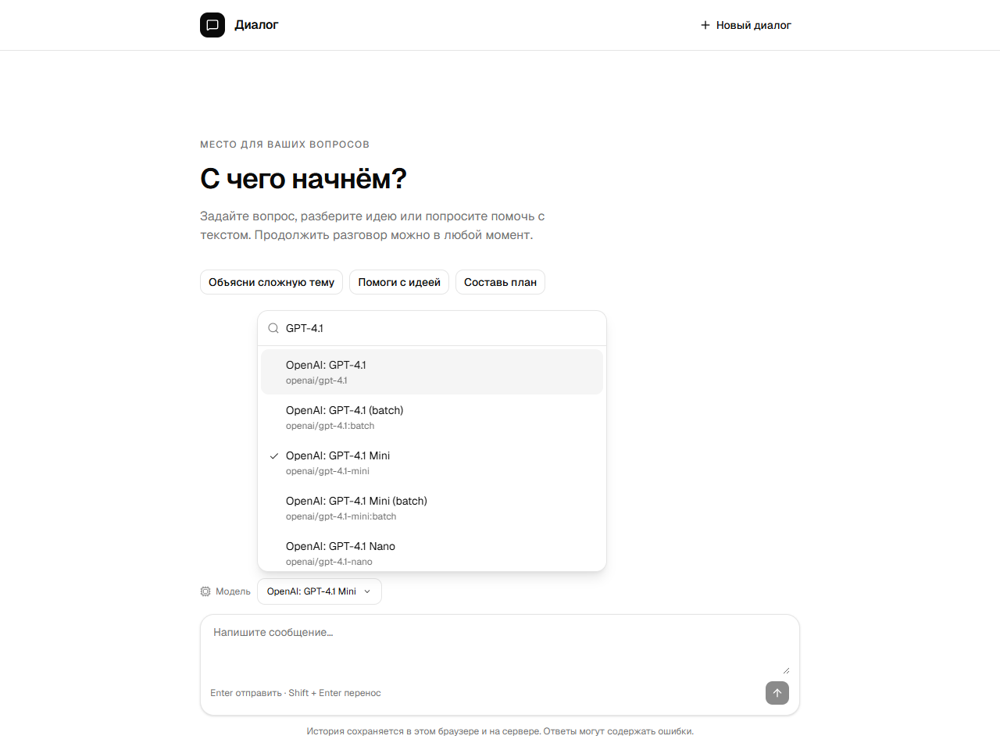

# Диалог

Небольшой чат без регистрации. Вопросы и ответы остаются в браузере и в PostgreSQL.
Сервер обращается к OpenRouter. Ключ видит только сервер.



## Быстрый запуск

Нужны **Node.js 24.14+** и запущенный **Docker**.

Windows:

```powershell
.\install.ps1
```

Linux или macOS:

```bash
bash install.sh
```

Скрипт установит зависимости, подготовит базу и соберёт приложение.
Повторный запуск сохраняет данные и настройки.

В `server/.env` укажите `AI_API_KEY`, затем:

```sh
npm run dev
```

Откройте **http://127.0.0.1:5173**.
После изменения `.env` перезапустите приложение.

По умолчанию выбрана **openai/gpt-4.1-nano**. Запросы оплачиваются с баланса OpenRouter.
Другую модель можно задать в `AI_MODEL`. Бесплатные варианты могут быть заняты.

Уже есть своя база? Запишите её адрес в `DATABASE_URL` и выполните
`./install.ps1 -SkipDocker` или `bash install.sh --skip-docker`.

## Как пользоваться

Введите вопрос и нажмите Enter. Shift + Enter добавляет новую строку.
«Новый диалог» начинает отдельную переписку. При обновлении страницы история возвращается.
У каждого сообщения есть время в часовом поясе браузера; полная дата видна при наведении.
Для старой истории, где время отправки не записывалось, используется время сохранения.

У моделей с пометкой **«Изображения»** можно прикрепить файл кнопкой рядом с полем
или вставить картинку через **Ctrl+V / Cmd+V**. Есть предпросмотр и удаление вложений.
Допускаются **3 файла по 2 МБ**: PNG, JPEG, WebP и GIF (первый кадр).
Можно отправить изображение без текста. Пока файлы прикреплены, текстовые модели
недоступны для выбора. Поддержка определяется по актуальному каталогу провайдера.

Изображения сохраняются в PostgreSQL и доступны только своей сессии. Сервер
проверяет содержимое, удаляет метаданные и уменьшает размер до 1600 пикселей
по длинной стороне. В контекст попадает до 3 последних изображений, включая новые;
при выборе текстовой модели передаётся только текст истории.

Если запрос не дошёл, текст вернётся в поле. Повторная отправка того же запроса
не создаёт вторую запись. При смене диалога в соседней вкладке история не смешивается.

Cookie действует **30 дней**. Если удалить её, старый диалог останется в базе,
но открыть его через этот браузер уже не получится. Списка старых диалогов пока нет.

## Архитектура

Приложение состоит из **React-клиента, одного Node.js-сервера и PostgreSQL**.
Клиент и сервер лежат в одном репозитории, но собираются как отдельные npm-пакеты.
OpenRouter подключён как внешний сервис.

```text
React в браузере
  ├─ cookie: подписанный идентификатор сессии
  ├─ localStorage: копия истории, выбранная модель, запрос для повтора
  └─ /api → Express → OpenRouter
                  └─ PostgreSQL: сообщения, изображения, счётчик запросов
```

**База хранит основную историю**, localStorage помогает показать её до ответа сервера.
Cookie с флагом HttpOnly браузер отправляет сам; JavaScript не читает её значение.
Сервер проверяет подпись и срок сессии. Дополнительный заголовок `X-Session-Id`
защищает от отправки из вкладки, в которой остался предыдущий диалог.

При отправке сервер проверяет сообщение и выбранную модель, берёт контекст из базы
и обращается к OpenRouter. После ответа сохраняет вопрос, ответ и вложения одной
транзакцией. Только после этого клиент обновляет историю. Ключ провайдера остаётся
на сервере. Каталог моделей запрашивается отдельно и кэшируется в памяти на 5 минут.

В разработке Vite работает на порту 5173 и передаёт `/api` серверу на 3001.
**В собранной версии Express раздаёт и страницу, и API** с одного адреса.
PostgreSQL запускается в Docker; данные остаются в отдельном томе при пересоздании
контейнера. Само приложение запускается через Node.js.

## Почему так сделано

- **Один сервер и одна база.** Для небольшого чата этого достаточно. Установщик
  поднимает понятный набор частей, а ошибки можно проверить локально.
- **React и обычные hooks.** На экране один диалог, черновик и выбор модели.
  Состояние остаётся рядом с этим экраном; отдельное хранилище состояния пока не нужно.
- **Сессия в cookie, история в базе.** Можно начать разговор сразу. Это доступ
  к конкретному диалогу из браузера, а не учётная запись с восстановлением доступа.
- **SQL через `pg`.** Запросов мало, их видно целиком. Параметры передаются отдельно
  от SQL. Транзакция и блокировка сессии не дают параллельным сообщениям перепутать
  контекст; `request_id` возвращает уже сохранённый ответ при повторе.
- **Изображения отдельно от сообщений.** История получает только их идентификаторы,
  сами файлы загружаются по мере просмотра. Для этого размера проекта удобно хранить
  их в PostgreSQL. При большом объёме файлов следующим шагом будет отдельное хранилище.
- **Готовые компоненты интерфейса.** shadcn/ui, Radix и cmdk дают основу для кнопок,
  всплывающего списка, фокуса и выбора с клавиатуры. В проекте остаются стили и поведение
  конкретного чата.
- **Полный ответ вместо потока.** Сейчас вопрос и ответ сохраняются как готовая пара.
  Это упрощает обработку ошибок. Потоковый вывод потребует отдельно хранить состояние
  незавершённого ответа и восстанавливать его после разрыва соединения.

Есть осознанные границы. **Соединение с базой занято, пока отвечает провайдер**;
одновременно сервер допускает до 4 таких запросов. Для небольшого тестового это
приемлемо. При росте нагрузки стоит вынести выполнение в очередь и хранить состояния
запросов отдельно. Лимиты в памяти рассчитаны на один процесс; для нескольких копий
сервера им понадобится общее хранилище.

Повтор не дублирует уже сохранённое сообщение, но **не гарантирует одно списание
у провайдера**: если ответ получен, а сохранение в базе не удалось, новое обращение
может быть платным. Автоматическое добавление полей при старте удобно на этом этапе;
для дальнейших изменений схемы нужны отдельные миграции.

## Технологии и версии

Ниже **точные версии из `package-lock.json`**. В `package.json` указаны допустимые
диапазоны, поэтому числа могут отличаться. `npm ci` устанавливает версии из lock-файла.

| Часть              | Технология                             | Версия                      | Для чего                                              |
| ------------------ | -------------------------------------- | --------------------------- | ----------------------------------------------------- |
| Интерфейс          | React / React DOM                      | **19.3.0**                  | Экран чата и состояние компонентов                    |
| Язык               | TypeScript                             | **6.0.3**                   | Проверка типов клиента и сервера                      |
| Сборка             | Vite                                   | **8.3.0**                   | Сервер разработки и сборка клиента                    |
| Стили              | Tailwind CSS                           | **4.3.3**                   | Оформление и адаптивная вёрстка                       |
| Компоненты         | shadcn CLI / Radix UI                  | **4.21.0 / 1.6.7**          | Компоненты в исходниках и поведение интерфейса        |
| Поиск моделей      | cmdk                                   | **1.1.1**                   | Фильтрация списка и управление с клавиатуры           |
| Иконки             | Lucide React                           | **1.47.0**                  | SVG-иконки                                            |
| HTTP-сервер        | Express                                | **5.2.1**                   | API и раздача собранного клиента                      |
| Доступ к базе      | pg                                     | **8.23.0**                  | SQL-запросы и пул соединений                          |
| Изображения        | sharp                                  | **0.35.4**                  | Проверка, уменьшение и перевод в WebP                 |
| Cookie             | cookie-parser                          | **1.4.7**                   | Чтение и проверка подписи cookie                      |
| Защита HTTP        | Helmet / express-rate-limit            | **8.3.0 / 8.7.0**           | Заголовки безопасности и ограничение запросов         |
| Тесты              | Vitest / Testing Library React / jsdom | **5.0.1 / 16.3.3 / 29.1.1** | Проверки сервера, компонентов и действий пользователя |
| Проверка кода      | Oxlint / Prettier                      | **1.83.0 / 3.9.7**          | Поиск ошибок и единый формат                          |
| Разработка сервера | tsx                                    | **4.23.13**                 | Запуск TypeScript с перезапуском при изменениях       |

Среда проверена на **Node.js 24.14.0**, **PostgreSQL 18.6** и **Docker Engine 29.5.3**.
Минимальная версия Node.js в проекте - **24.14.0**. Установщик использует образ
**`postgres:18`**: основная версия закреплена, точная версия обновления может меняться
при загрузке образа. Docker нужен установщику для базы; при своей PostgreSQL можно
запускать с `--skip-docker`.

OpenRouter подключён через **HTTP API `/api/v1`** и встроенный `fetch`, без отдельного
SDK. Список моделей и их возможности приходят от провайдера и не закреплены в коде.

## Где что лежит

- `client/src/App.tsx`: экран чата.
- `client/src/components/chat`: сообщения, время и состояние ожидания.
- `client/src/components/ui`: базовые компоненты shadcn/ui.
- `client/src/hooks/use-chat.ts`: отправка, повтор и переключение диалогов.
- `client/src/lib/chat.ts`: запросы к серверу и сохранение в браузере.
- `client/src/types/chat.ts`: формат данных, которые получает интерфейс.
- `server/src/app.ts`: обработка запросов и проверка сессии.
- `server/src/gateway.ts`: обращение к OpenRouter.
- `server/src/models.ts`: каталог моделей и поддержка изображений.
- `server/src/images.ts`: проверка и подготовка изображений.
- `server/src/db.ts`: чтение и запись сообщений.
- `server/src/config.ts`: проверка настроек.
- `scripts/setup.mjs`: общая часть двух установщиков.

Путь сообщения: **браузер → сервер → OpenRouter → база → браузер**.
В таблице `messages` сохранены исходные четыре поля. `request_id` отличает повтор
от нового запроса; `sent_at` хранит момент получения вопроса сервером,
а `created_at` - время сохранения ответа. Время хранится в UTC.
`image_ids` связывает сообщение с таблицей `message_images`; `image_hashes`
защищает повторный запрос от подмены вложений. Содержимое файлов хранится отдельно
и загружается по мере просмотра. При запуске сервер добавляет новые поля автоматически.

## Проверка

```sh
npm run lint
npm run format:check
npm test
npm run test:coverage
npm run build
```

Тесты используют отдельную временную область в PostgreSQL и удаляют только её.
Нужна доступная база из `server/.env` и право создавать схемы.
Тесты не тратят баланс OpenRouter. Подробный отчёт: `coverage/index.html`.

## Настройки и ограничения

Модель выбирается над полем сообщения. Список всех моделей загружается отдельно
через `GET /api/models`, сервер обращается к каталогу OpenRouter и кэширует его на
5 минут. Внутри списка есть поиск по названию, провайдеру и идентификатору
без учёта регистра. Список прокручивается; стрелки и Enter выбирают модель,
Escape закрывает окно. Если совпадений нет, появляется подсказка.
Выбор сохраняется в браузере; `AI_MODEL` задаёт начальную модель. Сообщение
передаёт выбранный идентификатор в поле `model`, сервер проверяет его по каталогу.
Доступность ответа зависит от модели и баланса у провайдера.

- `REQUESTS_PER_MINUTE=15`: сообщения с одного IP за минуту.
- `DAILY_REQUEST_LIMIT=100`: общий лимит обращений за 24 часа, включая неудачные.
- `SESSION_SECRET`: случайная строка для проверки cookie; установщик создаёт её сам.
- `AI_BASE_URL`: адрес провайдера, если нужен другой совместимый сервис.

В браузере показываются последние **200 пар сообщений**. Модели передаются
последние **20 пар**, не более **24 000 символов** вместе с новым вопросом.
Один вопрос ограничен **4000 символами**, ответ запрашивается до **1000 токенов**.

Для запуска собранной версии:

```sh
npm run build
npm start
```

Адрес: **http://127.0.0.1:3001**.

При публикации используйте HTTPS, задайте `COOKIE_SECURE=true` и
`APP_ORIGINS=https://ваш-домен`. `.env` не должен попадать в Git.
Число запросов ограничено, но это не денежный лимит: ограничение расходов
также стоит установить в кабинете OpenRouter.

Следом можно добавить потоковый ответ, список диалогов, удаление истории и экспорт.

## Как поддерживать порядок

Клиент и сервер остаются отдельными npm-пакетами с одним общим lock-файлом.
Компоненты отвечают за отображение, hooks - за состояние React, lib - за работу
с данными. На сервере создание приложения отделено от запуска: это позволяет
проверять маршруты без отдельного процесса. Тесты лежат рядом с каждым пакетом.

Форматирование: `npm run format`. Комментарии объясняют причины ограничений,
защиту от запоздавших ответов и совместимость со старой историей.
SQL пока находится в одном модуле. Если изменений базы станет больше,
следующий шаг - отдельные версионированные миграции.
